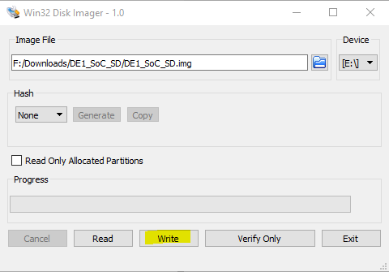
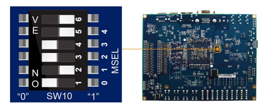
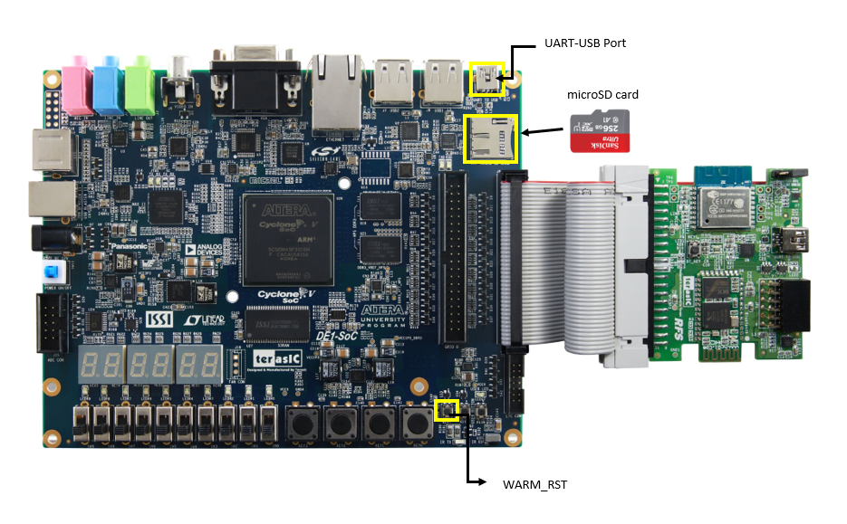
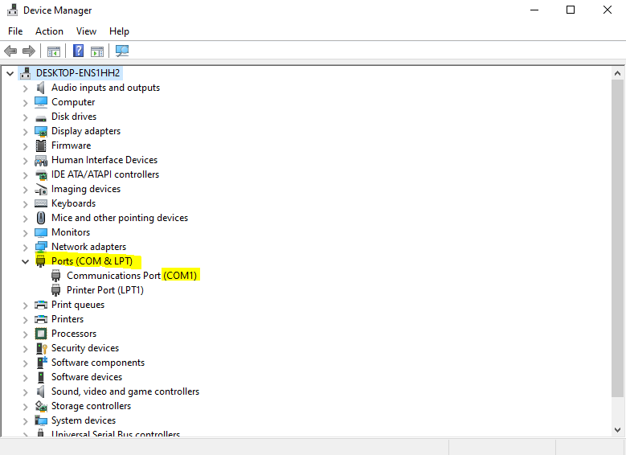
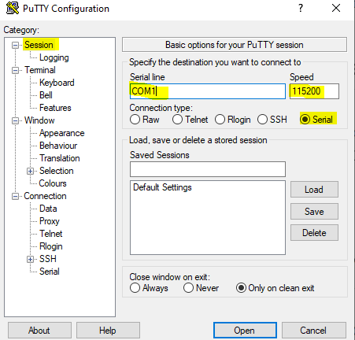
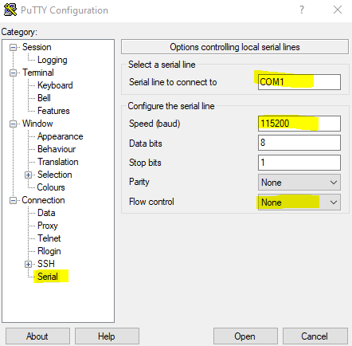
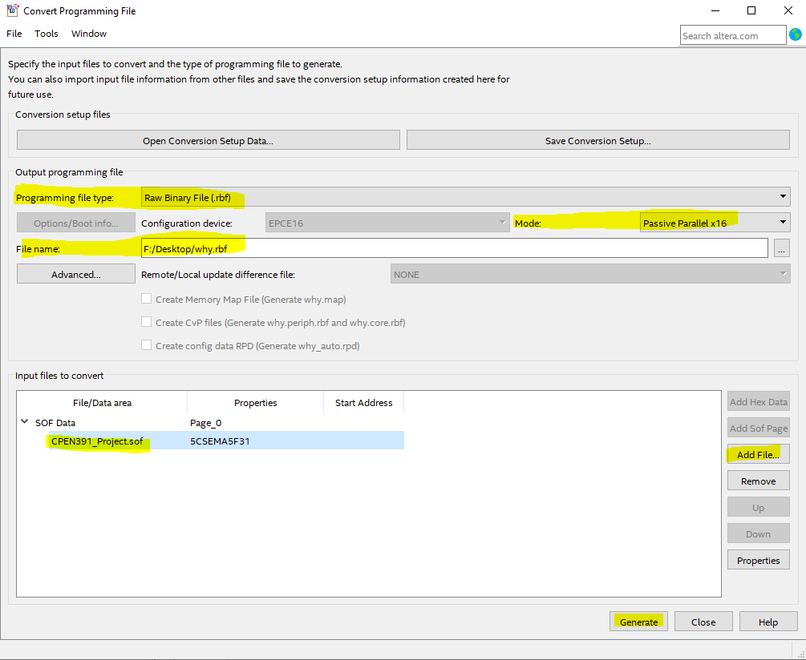

# Setting up Linux on DE1-SoC

## Hardware Requirements

- UART-USB Connector (black cable that comes with DE1)
- MicroSD card (8GB or larger) *(website says 4GB is okay too for some distributions)*
- MicroSD card reader
- DE1-SoC

## Imaging Linux on to MicroSD Card

### 1. Download the Linux Image from the terasic website
-   https://www.terasic.com.tw/cgi-bin/page/archive.pl?Language=English&No=836&PartNo=4
Currently I have ‘Linux Console with Kernel 3.12’ installed, this is a barebones command line with no GUI

### 2. Download an imager to write Linux on to the MicroSD card
Imagers:
- Windows:        https://sourceforge.net/projects/win32diskimager/
- Linux/MacOS: https://www.raspberrypi.org/software/
1. Plug in your microSD card to your computer using your microSD card reader
2. Launch Win32 Disk Imager and select the drive associated with the microSD card reader
3. Select the Linux image you downloaded above under 'Image file'
4. Click 'Write' to write to the microSD card. ***This will wipe whatever is currently stored in your microSD card***

Your microSD card is ready to be plugged into your DE1 now!
## Configuring FPGA
### Changing the Mode Select Switches
On the back of the FPGA board is the MSEL[4:0] pins, which are used to select the configuration scheme.
We will need to set MSEL[4:0]= 5’b01010. Note that the picture below does not have it set correctly.

## Connecting to the Linux FPGA UART Terminal
### 1. Download the Virtual Communication Port drivers (VCP)
-   [https://ftdichip.com/drivers/vcp-drivers/](https://ftdichip.com/drivers/vcp-drivers/)
   Install the drivers for your respective OS, for windows users, click the hyperlink for 'setup executable' in the Comments column. This allows your computer to detect the DE1 as an additional COMM Port on the PC. Reboot if necessary.
### 2. Download PuTTY
-   [https://www.chiark.greenend.org.uk/~sgtatham/putty/latest.html](https://www.chiark.greenend.org.uk/~sgtatham/putty/latest.html)
-   You can choose to download it as an executable or install it as a program. This allows us to connect to the DE1 U-ART Linux terminal through COMM ports.
### 3. Plug in the necessary cables and power on the DE1
1. Connect your PC to the DE1 using the USB-UART connector  
2. Insert your microSD in the orientation as shown in the picture
3. Power on the DE1

### 4. Launch PuTTY and connect
1. Determine what COMM Port is being associated with your DE1 by launching 'Device Manager' (Windows Users) and expanding the 'Ports' drop-down. If there is more than one COMM Port, you will have to power off/on the DE1 to see which COMM Port disappeared.

2. On the 'Session' view of PuTTY, select 'Serial' under *Connection Type*. Change the 'Serial line' value to the associated COMM port to the DE1, and also change the 'Speed' to 115200.

3. On the 'Serial' view of PuTTY, change the 'Serial line to connect to' to the appropriate COMM Port, the speed to 115200 and 'Flow Control' to None.

4. Click 'Open' to connect to the UART Terminal. You can login with credential 'root' if prompted.
5. (Optional) You can click the WARM_RST button (shown in the DE1 diagram above) on the DE1 to view the Linux boot process if you are unsure if it is working.

## Pre-flashing FPGA with firmware (Optional)

1. Write some firmware in Verilog and synthesize a '.sof' file
2. Launch Quartus and launch the 'Convert Programming Tool' by selecting File -> Convert Programming Files
3. Select (.rbf) as the Programming File Type
4. Select Passive Parallel x16 as the Mode
5. Specify your chosen destination file name in the File name field.
6. Click and highlight the .sof file that you wish to convert by clicking 'Add File'
7. Click your added '.sof' file and select Properties. Enable file compression by ticking the associated checkbox, leaving everything else as is.
8. Generate the file.

Move the generated `.rbf` to the Linux filesystem, and run [the script](./program.sh). This will flash the FPGA.

## Initializing the firmware at boot

We'll be using `init.d` in order to initialize the firmware, following the steps [here](https://unix.stackexchange.com/questions/56957/how-to-start-an-application-automatically-on-boot).

1. Move `program.sh` to `/etc/init.d`
2. Edit the script to hardcode the path of the `rbf` file.
3. Make sure we have execution permissions on the file.
4. Create the system link to start it at default (`update-rc.d program.sh defaults`)
